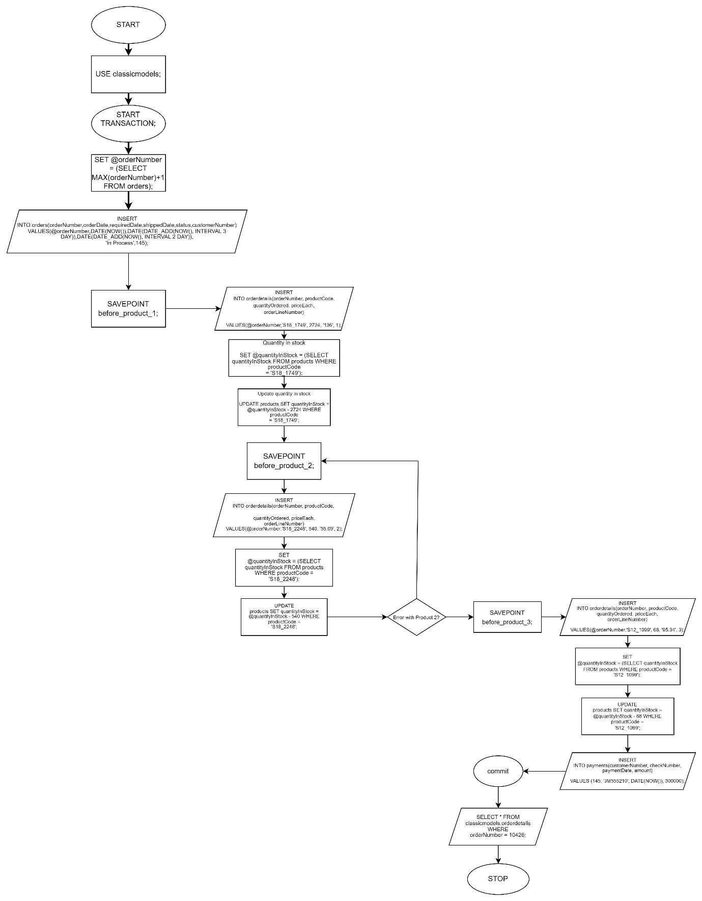

# BBT3104-Lab1of6-DatabaseTransactions

| **Key**                                                               | Value                                                                                                                                                                              |
|---------------|---------------------------------------------------------|
| **Group Name**                                                               | C12|
| **Semester Duration**                                                 | 19th August - 25th November 2024                                                                                                                       |

## Flowchart

## Pseudocode
START TRANSACTION;

// Generate a new order number
SET @orderNumber = (SELECT MAX(orderNumber) + 1 FROM orders);

// Insert order details for the first product
Then Insert
SAVEPOINT before_product_1;
INSERT INTO orderdetails (orderNumber, productCode, quantityOrdered, priceEach, orderLineNumber)
VALUES (@orderNumber, 'S18_1749', 2724, 136,1);

// Update stock quantity for the first product
SET @quantityInStock = (SELECT quantityInStock FROM products WHERE productCode = 'S18_1749');
UPDATE products
SET quantityInStock = @quantityInStock - 2724
WHERE productCode = 'S18_1749';

// Insert order details for the second product
SAVEPOINT before_product_2;
INSERT INTO orderdetails (orderNumber, productCode, quantityOrdered, priceEach, orderLineNumber)
VALUES (@orderNumber, 'S18_2248’, 540, 55.09, 2);

// Update stock quantity for the second product
SET @quantityInStock = (SELECT quantityInStock FROM products WHERE productCode = 'S18_2248');
UPDATE products
SET quantityInStock = @quantityInStock - /*quantity ordered for product 2*/
WHERE productCode = 'S18_2248';

// If there's an error with Product 2, rollback to the previous savepoint
// SAVEPOINT before_product_3 or similar would be called for error handling

// Insert order details for the third product
SAVEPOINT before_product_3;
INSERT INTO orderdetails (orderNumber, productCode, quantityOrdered, priceEach, orderLineNumber)
VALUES (@orderNumber, 'S12_1005', 68, 95.34, 3);

// Update stock quantity for the third product
SET @quantityInStock = (SELECT quantityInStock FROM products WHERE productCode = 'S12_1099’);
UPDATE products
SET quantityInStock = @quantityInStock - 68
WHERE productCode = 'S12_1099’;

INSERT INTO payments(customerNumber, checkNumber, paymentDate, amount)
VALUES(145, JM555210, DATE NOW()), 300000);
// Commit the transaction
COMMIT;
SELECT FROM classicmodels.orderdetails WHERE ordernumber =10426;

STOP THE TRANSACTION

## Support for the Sales Departments' Report
An extension of the database can be implemented to record the amount of money paid for an item and calculate the balance remaining. The database will contain fields such as depositAmount, installments, months, and the balance. A report can further be generated to display the banlance and due date.
